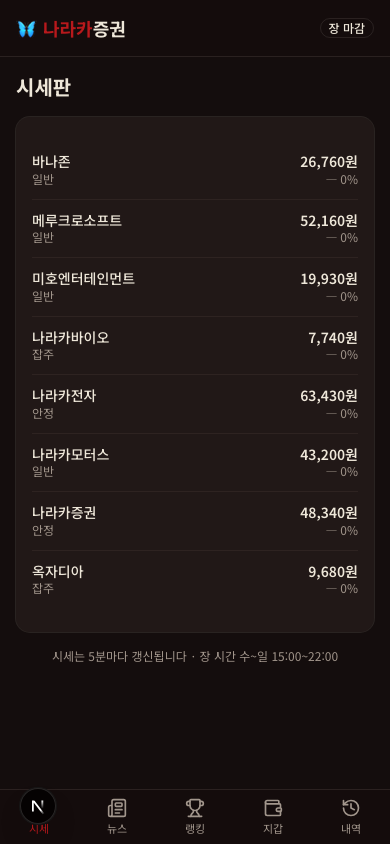
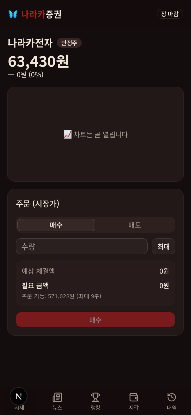
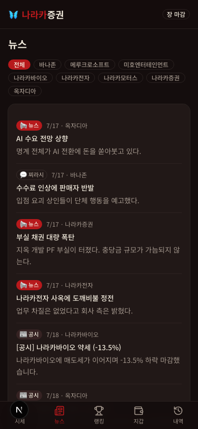
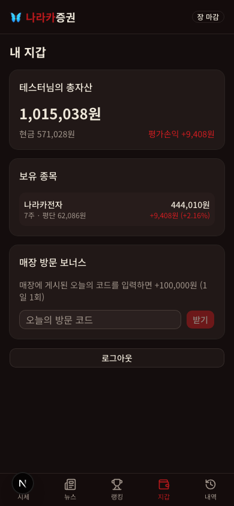

# 🦋 나라카증권 — NARAKA Stock Exchange

> 대구 동성로 요괴 컨셉카페 **나라카**의 8월 한정 이벤트, 모의 주식 거래 웹 서비스.
> 손님들이 가상 화폐 100만원으로 요괴 테마 주식 8종을 한 달간 사고팔고, 최종 총자산 상위 4명이 상품을 받는다.

- 이벤트 기간: **2026-08-01(토) ~ 08-30(일)** · 장 시간 수~일 15:00~22:00 KST (월·화 휴장)
- 디자인 컨셉: **"아기자기한 지옥"** — 무서운 지옥이 아니라 귀여운 요괴들의 지옥

## 스크린샷

| 시세판 | 종목·주문 | 뉴스 | 지갑 |
|:---:|:---:|:---:|:---:|
|  |  |  |  |

## 주요 기능

- **시세판**: 요괴 테마 8종목 전광판 — 5분 틱, 상한가(上)/하한가(下)/VI 배지, 일봉 캔들 + 당일 라인 차트
- **매매**: 시장가 즉시 체결 (매도 수수료 0.3%, 상하한 ±30%), 서버 단일 트랜잭션 검증
- **뉴스 시스템**: 📰 공시(100% 사실) / 📢 정식 뉴스(적중률 90%) / 💬 찌라시(적중률 55%) — 매일 밤 배치가 자동 발행하는 요괴 세계관 뉴스로 다음 날 장세 힌트 제공
- **방문 보너스**: 매장 게시 코드 입력 시 +100,000원 (1일 1회) — 재방문 유도
- **배당**: 안정주 보유 시 매주 금요일 평가액의 1% 현금 지급
- **랭킹**: 총자산 기준 상위 20명 + 내 등수 고정 표시
- **연출**: 틱 사이 가격 미세 진동, VI 5분 거래정지, 어드민 서킷브레이커·깜짝 이벤트(경로 재생성)
- **운영자 콘솔**: 가입 코드 묶음 발급, 방문 코드 자동 생성, 수동 뉴스, 유저 정지

## 기술 스택

| 분류 | 기술 |
|------|------|
| 프레임워크 | Next.js 16 (App Router, Turbopack) + React 19 |
| 언어 | TypeScript 5 (strict) |
| 스타일링 | Tailwind CSS v4 + shadcn/ui (다크 테마 고정) |
| 서버 상태 | TanStack Query v5 (틱 경계 정렬 폴링) |
| 폼/검증 | React Hook Form v7 + Zod v4 |
| 차트 | lightweight-charts v5 |
| DB | Supabase (PostgreSQL + RLS 전면 차단) |
| 인증 | 커스텀 (닉네임+비밀번호, jose JWT 쿠키) — 이메일 불필요 |
| 배치 | pg_cron → `/api/cron/daily-batch` (매일 22:00 KST) |
| 배포 | Vercel |

## 아키텍처 핵심 원칙

1. **모든 돈 계산은 서버에서** — 매수/매도는 Postgres 함수 단일 트랜잭션. 클라이언트는 (종목, 방향, 수량)만 보내며 가격·잔고를 절대 신뢰하지 않는다. 상품이 걸린 이벤트라 조작 방지가 곧 공정성.
2. **가격은 사전 생성 경로** — 매일 22:00 배치가 익일 84틱(5분 간격)을 전부 생성해 저장. 장중에는 읽기만 하므로 장중 크론이 없다. 뉴스 힌트도 이 사전 추첨에서 나온다.
3. **자산은 정수(원)** — 부동소수점 금지.
4. **프론트 보간 연출은 표시용** — 틱 사이 가격 애니메이션은 눈속임일 뿐, 체결가는 항상 서버 틱 값.

가격 엔진(랜덤워크 + 편향의 확률적 실현 + 점프 이벤트)은 TS 순수 함수로 작성되어 운영 배치와 몬테카를로 시뮬레이션(`npm run simulate`)이 같은 코드를 쓴다. 밸런스 목표(1위 총자산 3~10배, 특정 전략 압도 금지)는 개장일 22일 × 1,000회 시뮬레이션으로 검증했다.

## 폴더 구조

```
src/
├── app/            # 라우트 (시세판·종목·뉴스·랭킹·지갑·내역·가이드·어드민 + API)
├── components/     # UI 컴포넌트 (layout / quotes / chart / trade / news / ui)
├── hooks/          # useQuotes(틱 정렬 폴링), usePriceWiggle(보간 연출)
├── lib/
│   ├── engine/     # 가격 엔진 순수 함수 (랜덤워크·편향 추첨·시드 RNG)
│   ├── news/       # 뉴스 템플릿 168종 + 생성 로직
│   ├── auth/       # 세션(JWT)·비밀번호·닉네임 필터·가드
│   └── market.ts   # 장 시간·틱 인덱스·개장일 판정 (KST)
├── services/       # 배치·시세·거래·포트폴리오·뉴스·랭킹·어드민
└── proxy.ts        # 라우트 보호 (Next 16의 middleware)
supabase/
├── migrations/     # 스키마 + RLS + 체결/배치/가입 Postgres 함수
└── seed.sql        # 종목 8종·기준가·게임 설정
scripts/simulate.ts # 밸런스 몬테카를로 시뮬레이션
docs/               # PRD · ROADMAP · DEPLOY (배포 가이드) · 디자인 레퍼런스
```

## 시작하기 (로컬 개발)

요구사항: Node.js 20.9+, Docker (로컬 Supabase용)

```bash
npm install
npx supabase start      # 로컬 Supabase 스택 (최초 실행 시 이미지 다운로드)
npx supabase db reset   # 마이그레이션 + 시드 적용
cp .env.example .env.local  # 로컬 키 설정 (아래 환경 변수 참고)
npm run dev             # http://localhost:3000
```

테스트용 가입 코드 `TEST-0001`~`TEST-0010`, 오늘 방문 코드 `VISIT-TEST`가 시드에 포함되어 있다.

일일 배치 수동 실행 (익일 틱·뉴스 생성):

```bash
curl -X POST "http://localhost:3000/api/cron/daily-batch?date=2026-08-01" \
  -H "Authorization: Bearer $CRON_SECRET"
```

## 주요 명령어

```bash
npm run dev       # 개발 서버
npm run build     # 프로덕션 빌드
npm run lint      # ESLint
npm run simulate  # 밸런스 시뮬레이션 (옵션: -- --runs 1000)
```

## 환경 변수

`.env.local`에 설정 (템플릿: `.env.example`):

```env
SUPABASE_URL=                # Supabase 프로젝트 URL (로컬: http://127.0.0.1:54321)
SUPABASE_SERVICE_ROLE_KEY=   # service role 키 — 서버 전용, 절대 공개 금지
SESSION_SECRET=              # 세션 JWT 서명 키 (32자 이상 랜덤)
CRON_SECRET=                 # 일일 배치 트리거 인증 키
```

## 배포

Supabase 프로덕션 프로젝트 생성 → Vercel 연결 → pg_cron 등록 순서로 진행한다.
전체 절차와 리허설 체크리스트는 **[docs/DEPLOY.md](docs/DEPLOY.md)** 참고.

## 문서

| 문서 | 내용 |
|------|------|
| [docs/PRD.md](docs/PRD.md) | 게임 규칙·가격 엔진·뉴스 시스템·밸런스 전체 명세 |
| [docs/ROADMAP.md](docs/ROADMAP.md) | Phase 0~7 작업 체크리스트·진행률 |
| [docs/DEPLOY.md](docs/DEPLOY.md) | 배포·pg_cron 등록·리허설 가이드 |

---

카페 이벤트용 비공개 프로젝트입니다. 실제 금전 거래와 무관하며, 상품은 오프라인으로 지급됩니다.
